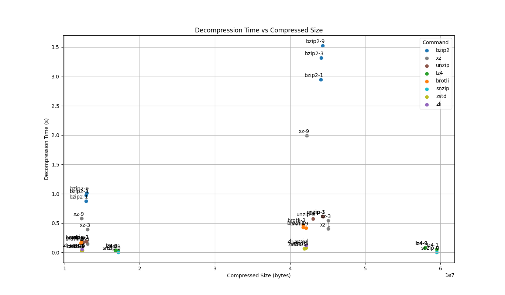

# Firefox Translation model compression analysis

Files are models in use in Firefox currently (2025-02-11).

Fetch other files from https://gregtatum.github.io/taskcluster-tools/src/models/

Rename inside the scripts, a lot is hard-coded.
```
uv venv
source .venv/bin/activate
uv pip install matplotlib
./compress.sh
./decompress.sh
uv run plot.py
```


